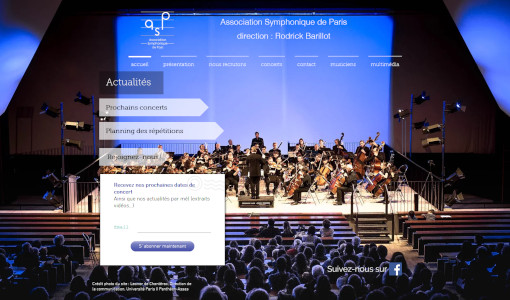

# Association Symphonique de Paris

Ce site est en construction. Pour voir le site opérationnel, cliquez sur l'image ci-dessous :

## Actualités

- Prochains concerts
- Planning des répétitions
- Rejoignez-nous !

## Présentation

L'Association Symphonique de Paris a été fondée en 1923 sous le nom d'Amicale Symphonique du 14ème et prend son nom actuel en 1936. Elle a pu entretenir des liens privilégiés avec la mairie du 13ème depuis 1945.

Association d'enseignement musical et d'éducation populaire, elle se donne trois missions :

- Permettre à des musiciens d'horizons divers (amateurs, professionnels retraités et étudiants en musique) de se retrouver au sein d'une structure symphonique conviviale afin d'aborder les répertoires profanes ou sacrés, de développer leur maitrise des techniques d'orchestre et de produire un résultat collectif;
- Faire découvrir des oeuvres variées à des auditoires parfois peu familiers du répertoire classique, notamment en irriguant certaines communes parfois négligées par les institutions musicales classiques. Contribuer à faire connaitre de jeunes compositeurs;
- Participer à des projets humanitaires ou développer des actions de découverte de la musique classique au sein d'institutions telles que l'Ecole, l'hopital, les établissements de retraites et les centres de détention.

L'association travaille en différentes formations :
- en orchestre symphonique (une cinquantaine de musiciens);
- en formation de chambre (avec les solistes issus de ses rangs);
- en accompagnement d'instrumentistes solistes;
- avec choeur et solistes vocaux.

## Nous recrutons

## Concerts

### Prochains Concerts

### Concerts Précedents
